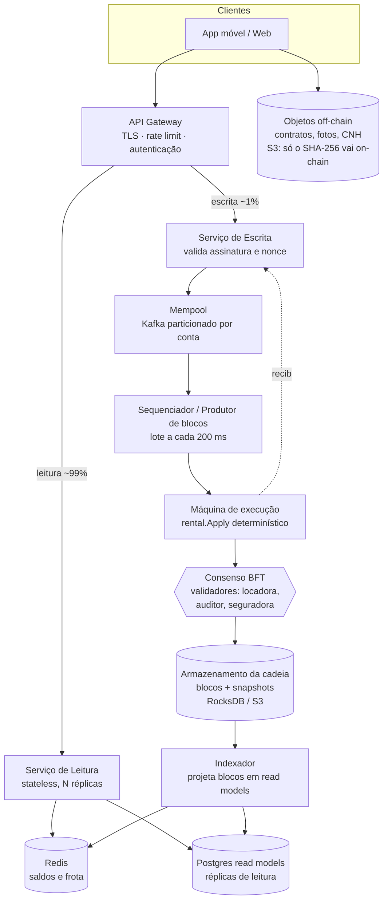

# Aluguel de Carros com Blockchain

**Tokenização de depósitos e caução em uma blockchain escrita em Go**

Proposta de sistema empregando blockchain para aluguel de carros, utilizando tokenização não fungível de bens para custodia e pagamentos. 
Realizado como avaliação no curso de Sistemas de Informação na Universidade do Estado do Amazonas.

---

## 1. Introdução

Este projeto é uma blockchain funcional, escrita do zero em **Go 1.23 usando apenas a biblioteca
padrão** (zero dependências externas), com um **ledger de aluguel de carros** rodando em cima dela e
uma **interface web em português** onde a mesma pessoa pode se colocar no papel de administrador,
proprietário ou locatário e ainda inspecionar a cadeia bloco por bloco.


Como executar:

```bash
cd car-rent-blockchain
go test ./...                  # testes da cadeia, das regras de locação e da API
go run ./cmd/console           # fase 1: a demo portada do Java
go run ./cmd/server --debug    # fases 2 e 3: http://localhost:8080
```

A flag `--debug` libera a demonstração de adulteração de blocos no explorador — o recurso didático
mais importante do projeto, explicado na seção 6.

### Mapa do código

```text
car-rent-blockchain/
  blockchain/      bloco, hash SHA-256, prova de trabalho, validação da cadeia
  rental/          transações, estado do mundo, regras de negócio, replay, mensagens pt-BR
  api/             servidor HTTP: a cadeia e o ledger expostos como JSON
  web/             app de navegador
  cmd/server/      binário do servidor
```

---

## 2. O problema

Alugar um carro envolve **dinheiro parado em mãos de terceiros**. O locatário entrega uma caução —
hoje, um bloqueio no cartão de crédito — e essa caução fica sob controle exclusivo da locadora até
que alguém, dentro da locadora, decida devolvê-la.

Os pontos de dor são concretos:

1. **Opacidade da custódia.** O locatário não tem como verificar que sua caução existe, quanto é, ou
   se já foi liberada. A única fonte de verdade é o banco de dados interno da locadora.
2. **Assimetria na liquidação.** Quem decide o valor do dano é a mesma parte que recebe o dinheiro.
   O locatário descobre o desconto depois do fato, sem trilha auditável do cálculo.
3. **Disputas sem prova.** "Eu devolvi o carro no dia 10" contra "foi no dia 12" é uma disputa
   sem registro independente. Logs de sistema pertencem a uma das partes e podem ser editados.
4. **Conciliação manual entre partes.** Locadora, proprietário da frota (em modelos peer-to-peer
   como Turo) e locatário mantêm planilhas diferentes do mesmo aluguel; fechar o mês é reconciliar
   três versões da verdade.
5. **Dinheiro bloqueado sem regra explícita.** O prazo de liberação da caução não é verificável; é
   uma promessa operacional.

O denominador comum: **o estado do negócio vive em um banco de dados que uma das partes pode
alterar sem deixar rastro, e as regras de liquidação vivem no código interno dessa mesma parte.**

Reescrevendo isso como requisitos técnicos, precisamos de:

- **Histórico imutável e verificável** — qualquer parte consegue provar que o registro não mudou.
- **Regras executadas de forma determinística** — a liquidação é aritmética pública, não decisão.
- **Custódia que não pertence a nenhuma das partes** — a caução sai da conta do locatário e **não**
  entra na conta do proprietário; fica num terceiro lugar que ninguém controla diretamente.
- **Autorização explícita por papel** — quem pode emitir tokens, registrar carro, alugar, devolver e
  liquidar é definido no protocolo, não no formulário da tela.

---

## 3. Blockchain: o fundamental

Uma blockchain é uma lista encadeada onde **cada elo é um hash criptográfico do elo anterior**. Isso
é suficiente para que alterar qualquer registro antigo quebre, de forma detectável, todos os
registros posteriores.

### 3.1 O bloco

```go
// blockchain/block.go
type Block struct {
	Index        int
	Timestamp    int64  // milissegundos Unix
	Hash         string
	PreviousHash string
	Data         string // a carga: no nosso caso, uma transação JSON
	Nonce        int
}
```

### 3.2 O hash

O hash é SHA-256 da concatenação dos campos do bloco. É aqui que nasce a imutabilidade: mudar um
único byte de `Data` muda o hash inteiro.

```go
// blockchain/block.go
func (b *Block) hashInput() string {
	prev := b.PreviousHash
	if prev == "" {
		prev = "null" // o genesis não tem anterior
	}
	return strconv.FormatInt(int64(b.Index)+b.Timestamp, 10) + prev + b.Data + strconv.Itoa(b.Nonce)
}

func CalculateHash(b *Block) string {
	sum := sha256.Sum256([]byte(b.hashInput()))
	return hex.EncodeToString(sum[:])
}
```

> **Nota de fidelidade ao port.** Em Java, `index + timestamp + previousHash + ...` é avaliado da
> esquerda para a direita, então `index` e `timestamp` são **somados como números** antes de a
> primeira string entrar na expressão, e um `previousHash` nulo é impresso como `"null"`. As duas
> peculiaridades foram preservadas de propósito: o port em Go produz **exatamente o mesmo SHA-256**
> que o original em Java para a mesma entrada.

### 3.3 Prova de trabalho (mineração)

O hash por si só impede alteração silenciosa, mas não **custa nada** produzir. A prova de trabalho
exige que o hash comece com um número de zeros — e como SHA-256 é imprevisível, o único caminho é
tentar valores de `Nonce` até acertar.

```go
// blockchain/block.go
func (b *Block) ProofOfWork(difficulty int) {
	b.Nonce = 0
	target := Zeros(difficulty) // "000" para dificuldade 3
	for !strings.HasPrefix(b.Hash, target) {
		b.Nonce++
		b.Hash = CalculateHash(b)
	}
}
```

Cada zero adicional multiplica por ~16 o trabalho esperado. É isso que torna **reescrever a história
caro**: quem adultera o bloco 3 precisa reminerar os blocos 3, 4, 5... até o fim da cadeia.

### 3.4 O encadeamento

```go
// blockchain/blockchain.go
type Blockchain struct {
	Difficulty int
	Blocks     []*Block
}

func NewBlockchain(difficulty int) *Blockchain {
	genesis := NewBlock(0, time.Now().UnixMilli(), "", "Bloco gênesis")
	genesis.ProofOfWork(difficulty)
	return &Blockchain{Difficulty: difficulty, Blocks: []*Block{genesis}}
}

// NewBlock liga o bloco novo ao último: previousHash = hash do último.
func (bc *Blockchain) NewBlock(data string) *Block {
	latest := bc.LatestBlock()
	return NewBlock(latest.Index+1, time.Now().UnixMilli(), latest.Hash, data)
}

// AddBlock minera e então acrescenta.
func (bc *Blockchain) AddBlock(b *Block) {
	b.ProofOfWork(bc.Difficulty)
	bc.Blocks = append(bc.Blocks, b)
}
```

### 3.5 Validação

Validar é refazer as três perguntas em cada bloco: o índice segue o anterior? o `PreviousHash`
aponta de fato para o hash do anterior? o hash armazenado é igual ao hash recalculado?

```go
// blockchain/blockchain.go
func isValidNewBlock(newBlock, previousBlock *Block) bool {
	return previousBlock.Index+1 == newBlock.Index &&
		newBlock.PreviousHash != "" &&
		newBlock.PreviousHash == previousBlock.Hash &&
		newBlock.Hash != "" &&
		CalculateHash(newBlock) == newBlock.Hash // <- pega qualquer alteração em Data
}

func (bc *Blockchain) IsValid() bool {
	if !bc.isFirstBlockValid() {
		return false
	}
	for i := 1; i < len(bc.Blocks); i++ {
		if !isValidNewBlock(bc.Blocks[i], bc.Blocks[i-1]) {
			return false
		}
	}
	return true
}
```

**É só isso.** Blocos, hash encadeado, prova de trabalho e validação — quatro ideias, cerca de 120
linhas de Go. Todo o resto do sistema é domínio de negócio construído sobre essa base.

---

## 4. Como resolvemos o problema com blockchain

A cadeia da seção 3 guarda strings. O pacote [rental/](car-rent-blockchain/rental/) transforma essas
strings em um **ledger de locação**, e cada dor da seção 2 vira uma propriedade do protocolo.

### 4.1 Cada bloco carrega uma transação

`Block.Data` passa a conter uma transação em JSON:

```go
// rental/tx.go
type Tx struct {
	From   string          `json:"from"`
	Method string          `json:"method"`
	Args   json.RawMessage `json:"args"`
	Nonce  uint64          `json:"nonce"`
}
```

### 4.2 O estado é derivado, nunca armazenado

Esta é a decisão de arquitetura central: **não existe banco de dados do estado.** Saldos, carros e
locações são o *resultado* de aplicar todas as transações em ordem.

```go
// rental/validate.go
func Replay(bc *blockchain.Blockchain) (*State, error) {
	s := NewState()
	for _, b := range bc.Blocks[1:] { // bloco 0 é o genesis, texto puro
		tx, err := ParseTx(b.Data)
		if err != nil {
			return nil, &ReplayError{b.Index, err}
		}
		if _, err := s.Apply(tx); err != nil {
			return nil, &ReplayError{b.Index, err}
		}
	}
	return s, nil
}
```

Consequência direta: **não há saldo que não tenha vindo de uma transação registrada em bloco.** Não
existe `UPDATE balances SET ...`. Para mudar um saldo é preciso um bloco; para mudar um bloco antigo
é preciso reminerar a cadeia inteira — e a validação denuncia antes disso.

### 4.3 Autorização por papel, no protocolo

```go
// rental/rules.go
var methodRoles = map[string]Role{
	"MintDeposit":  RoleAdmin,  // só o administrador emite tokens
	"RegisterCar":  RoleOwner,  // só o proprietário cadastra carro
	"StartRental":  RoleRenter, // só o locatário aluga
	"ReturnCar":    RoleRenter, // só o locatário devolve
	"SettleRental": RoleAdmin,  // só o administrador liquida
}
```

A checagem acontece antes de qualquer efeito, junto com a verificação de conta e de nonce:

```go
func (s *State) apply(tx *Tx) (*Receipt, error) {
	role, ok := s.Roles[tx.From]
	if !ok {
		return nil, ErrUnknownAccount
	}
	if tx.Nonce != s.Nonces[tx.From]+1 { // sequencial: sem replay, sem duplicata
		return nil, ErrBadNonce
	}
	required, ok := methodRoles[tx.Method]
	if !ok {
		return nil, ErrUnknownMethod
	}
	if role != required {
		return nil, ErrMissingRole
	}
	// ... despacho para a regra do método
}
```

O nonce sequencial por conta resolve de graça dois problemas clássicos: **replay** (reenviar a mesma
transação assinada) e **duplicação por retry** de rede.

### 4.4 Atomicidade: tudo ou nada

Uma transação roda sobre uma **cópia** do estado. Se qualquer regra falhar, a cópia é descartada e o
estado original fica intacto — não existe transação parcialmente aplicada.

```go
// rental/rules.go
func (s *State) Apply(tx *Tx) (*Receipt, error) {
	next := s.Clone()
	receipt, err := next.apply(tx)
	if err != nil {
		return nil, err // s não foi tocado
	}
	*s = *next
	return receipt, nil
}
```

E o servidor só escreve o bloco **depois** que a transação foi aceita, de forma que a cadeia nunca
contém transação inválida:

```go
// api/server.go
receipt, err := s.state.Apply(&tx)
if err != nil {
	writeError(w, http.StatusUnprocessableEntity, code, rental.Message(err))
	return
}
data, _ := tx.Encode()
block := s.bc.NewBlock(data)
s.bc.AddBlock(block) // minera e acrescenta
```

### 4.5 Validação completa = criptografia + regras

`ValidateChain` é a resposta para "posso confiar neste histórico?". Ela verifica as três checagens
criptográficas, mais a prova de trabalho, mais a reexecução de todas as regras de negócio — e aponta
**qual** bloco falhou e **por quê**, em português:

```go
// rental/validate.go
func ValidateChain(bc *blockchain.Blockchain) Validation {
	target := blockchain.Zeros(bc.Difficulty)
	for i, b := range bc.Blocks {
		switch {
		case b.Index != i:
			return invalid(i, "O índice do bloco está incorreto.")
		case i == 0 && b.PreviousHash != "":
			return invalid(i, "O bloco gênesis não pode ter hash anterior.")
		case i > 0 && b.PreviousHash != bc.Blocks[i-1].Hash:
			return invalid(i, "O hash anterior não confere com o hash do bloco anterior.")
		case b.Hash == "" || blockchain.CalculateHash(b) != b.Hash:
			return invalid(i, "O hash armazenado difere do hash recalculado: os dados do bloco foram alterados.")
		case !strings.HasPrefix(b.Hash, target):
			return invalid(i, "O hash não atende à dificuldade (prova de trabalho ausente).")
		}
	}
	if _, err := Replay(bc); err != nil { // as regras também fazem parte da validade
		// ...
	}
	return Validation{Valid: true}
}
```

### 4.6 De volta às dores da seção 2

| Dor | Como a blockchain resolve |
| --- | --- |
| Custódia opaca | A caução vai para a conta `escrow`, visível em `GET /api/accounts`, e sai dela apenas por `SettleRental` |
| Liquidação assimétrica | O cálculo é aritmética determinística em `settleRental`, auditável por qualquer parte |
| Disputa sem prova | Cada ação é um bloco minerado, com timestamp e hash encadeado |
| Conciliação manual | Há um único ledger; todas as partes derivam o mesmo estado do mesmo histórico |
| Regra implícita | `methodRoles` e as regras de cada método *são* o contrato, em código executável |

---

## 5. Tokenização

**Tokenizar é representar um direito econômico como saldo transferível em um ledger, sujeito a
regras executáveis.** Aqui o ativo tokenizado é o **depósito de caução**.

### 5.1 O token de depósito

```go
// rental/state.go
type State struct {
	Roles        map[string]Role
	Balances     map[string]uint64 // saldos do token de depósito, inclusive o escrow
	Nonces       map[string]uint64
	Cars         map[uint64]*Car
	Rentals      map[uint64]*Rental
	NextCarID    uint64
	NextRentalID uint64
	Minted       uint64 // total já emitido
}
```

Propriedades de projeto:

- **Inteiro sem sinal (`uint64`), nunca ponto flutuante.** Dinheiro em `float` acumula erro; o token
  é uma unidade indivisível, como centavos.
- **Emissão controlada.** Só `MintDeposit`, só pelo `ADMIN`, e cada emissão soma em `Minted`.
- **Aritmética verificada contra overflow**, em todo crédito e toda multiplicação:

```go
// rental/rules.go
func mulChecked(a, b uint64) (uint64, error) {
	if a != 0 && (a*b)/a != b {
		return 0, ErrOverflow
	}
	return a * b, nil
}
```

### 5.2 O invariante contábil

```go
// rental/state.go
// TotalHeld é a soma de todos os saldos, escrow incluído. Sempre igual a Minted.
func (s *State) TotalHeld() uint64 {
	var total uint64
	for _, v := range s.Balances {
		total += v
	}
	return total
}
```

`TotalHeld() == Minted` é o invariante que define a sanidade do token: **nenhuma operação cria nem
destrói valor** — apenas movimenta. Alugar, devolver e liquidar são transferências; só `MintDeposit`
altera o total, e de forma explícita e registrada. Os testes em
[rental/rental_test.go](car-rent-blockchain/rental/rental_test.go) checam esse invariante.

### 5.3 O escrow: custódia que não pertence a ninguém

```go
// rental/state.go
// Escrow é a pseudoconta que guarda os depósitos bloqueados. Não tem papel,
// então não pode nem enviar transações nem receber tokens emitidos.
const Escrow = "escrow"
```

O detalhe elegante: **o escrow não tem papel**. Como toda transação exige `s.Roles[tx.From]`, o
escrow é incapaz de assinar qualquer coisa — e como `MintDeposit` também exige que o destinatário
tenha papel, ninguém pode emitir tokens direto nele. O escrow só se move como **efeito colateral das
regras de locação**. Em vez de "confie que não mexemos na caução", temos "é estruturalmente
impossível mexer".

### 5.4 Tokenização do ativo físico

O carro também é tokenizado, como um registro com dono, preço e estado:

```go
// rental/state.go
type Car struct {
	ID         uint64    `json:"id"`
	Owner      string    `json:"owner"`
	DailyRate  uint64    `json:"dailyRate"`
	MinDeposit uint64    `json:"minDeposit"`
	Status     CarStatus `json:"status"` // AVAILABLE | RENTED
}
```

`Status` no ledger é o que impede locação dupla: `StartRental` exige `CarAvailable`, e a própria
transação marca o carro como `RENTED` no mesmo passo atômico.

### 5.5 O ciclo de vida: onde o token se move

```text
MintDeposit     admin ──emite 1000──▶ bob
StartRental     bob ──600 tokens──▶ escrow     [carro: RENTED, locação: ACTIVE]
ReturnCar       (nenhum token se move)         [locação: RETURNED]
SettleRental    escrow ──cobrança──▶ alice
                escrow ──reembolso──▶ bob      [carro: AVAILABLE, locação: CLOSED]
```

O bloqueio em `StartRental`:

```go
// rental/rules.go
rent, err := mulChecked(a.Days, car.DailyRate)  // preço travado no momento da locação
if a.Deposit < car.MinDeposit || a.Deposit < rent {
	return nil, ErrDepositTooLow  // a caução tem que cobrir o aluguel
}
if s.Balances[tx.From] < a.Deposit {
	return nil, ErrInsufficientBalance
}
s.credit(Escrow, a.Deposit)
s.Balances[tx.From] -= a.Deposit
car.Status = CarRented
```

E a liquidação — o coração econômico do sistema, oito linhas de aritmética pública:

```go
// rental/rules.go
charge, err := addChecked(r.Rent, a.DamageCharge)
var unpaid uint64
if charge > r.Deposit {
	unpaid = charge - r.Deposit  // o que a caução não cobriu fica registrado
	charge = r.Deposit           // nunca se cobra além do depositado
}
refund := r.Deposit - charge
s.credit(r.Owner, charge)        // proprietário recebe aluguel + danos
s.credit(r.Renter, refund)       // locatário recebe o que sobrou
s.Balances[Escrow] -= r.Deposit  // o escrow esvazia por completo
r.Status = RentalClosed
s.Cars[r.CarID].Status = CarAvailable
```

Três garantias estruturais aqui:

1. **O escrow nunca retém resíduo** — `charge + refund == r.Deposit`, sempre.
2. **A cobrança é limitada pela caução** — o excesso não é cobrado à força; é registrado como
   `Unpaid`, uma dívida transparente a ser tratada fora da cadeia.
3. **O preço é imutável** — `r.Rent` foi calculado no `StartRental`; se o proprietário mudar a
   diária depois, a locação em curso não é afetada.

---

## 6. Exemplos

### 6.1 A demo do terminal (fase 1)

```bash
cd car-rent-blockchain && go run ./cmd/console
```

```text
Bloco #0 [hashAnterior : , dataHora : 05/10/2025 20:41:03, dados : Bloco gênesis, hash : 0000a3f1...]
Bloco #1 [hashAnterior : 0000a3f1..., dataHora : 05/10/2025 20:41:03, dados : Tout sur le Bitcoin, hash : 0000b7c2...]
Bloco #2 [hashAnterior : 0000b7c2..., dataHora : 05/10/2025 20:41:04, dados : Sylvain Saurel, hash : 00001d8e...]
...
A blockchain é válida?
Sim, é válida!
```

Note que todo hash começa com quatro zeros: dificuldade 4, a mesma do `Main.java` original.

### 6.2 Um aluguel completo via HTTP

Servidor: `go run ./cmd/server --debug`. Contas de desenvolvimento: `admin` (ADMIN), `alice`
(OWNER), `bob` (RENTER).

```bash
# 1. O admin emite 1000 tokens de depósito para bob
curl -s localhost:8080/api/tx -d '{
  "from":"admin","method":"MintDeposit","nonce":1,
  "args":{"to":"bob","amount":1000}}'

# 2. Alice registra um carro: diária 100, depósito mínimo 300
curl -s localhost:8080/api/tx -d '{
  "from":"alice","method":"RegisterCar","nonce":1,
  "args":{"dailyRate":100,"minDeposit":300}}'
# -> receipt: {"carId":1}

# 3. Bob aluga o carro 1 por 5 dias, caução de 600 (aluguel = 500)
curl -s localhost:8080/api/tx -d '{
  "from":"bob","method":"StartRental","nonce":1,
  "args":{"carId":1,"days":5,"deposit":600}}'
# -> receipt: {"carId":1,"rentalId":1}
# estado: bob 400 · escrow 600 · alice 0

# 4. Bob devolve o carro
curl -s localhost:8080/api/tx -d '{
  "from":"bob","method":"ReturnCar","nonce":2,
  "args":{"rentalId":1}}'
# locação: RETURNED (aguardando inspeção)

# 5. O admin liquida, com 50 de dano constatado
curl -s localhost:8080/api/tx -d '{
  "from":"admin","method":"SettleRental","nonce":2,
  "args":{"rentalId":1,"damageCharge":50}}'
# -> receipt: {"carId":1,"rentalId":1,"paid":550,"refunded":50,"unpaid":0}
```

Conferindo a contabilidade — `paid 550 + refunded 50 == deposit 600`, escrow zerado, e
`400 + 550 + 50 == 1000 == minted`:

```bash
curl -s localhost:8080/api/accounts
```

```json
{
  "accounts": [
    {"name":"admin","role":"ADMIN","balance":0,"nextNonce":3},
    {"name":"alice","role":"OWNER","balance":550,"nextNonce":2},
    {"name":"bob","role":"RENTER","balance":450,"nextNonce":3}
  ],
  "escrow": 0,
  "minted": 1000
}
```

A cadeia agora tem seis blocos: o genesis mais uma transação por bloco.

### 6.3 Regras rejeitando o que deve rejeitar

```bash
# Caução abaixo do aluguel (5 dias x 100 = 500)
curl -s localhost:8080/api/tx -d '{"from":"bob","method":"StartRental","nonce":3,
  "args":{"carId":1,"days":5,"deposit":400}}'
# 422 {"codigo":"ErrDepositTooLow","mensagem":"O depósito é menor que o mínimo do carro ou que o valor do aluguel."}

# Papel errado: proprietário tentando emitir tokens
curl -s localhost:8080/api/tx -d '{"from":"alice","method":"MintDeposit","nonce":2,
  "args":{"to":"alice","amount":999999}}'
# 422 {"codigo":"ErrMissingRole", ...}

# Nonce repetido (ataque de replay)
curl -s localhost:8080/api/tx -d '{"from":"bob","method":"ReturnCar","nonce":2,
  "args":{"rentalId":1}}'
# 422 {"codigo":"ErrBadNonce", ...}
```

Toda rejeição deixa a cadeia **inalterada**: nenhum bloco é minerado para transação inválida.

### 6.4 A demonstração de adulteração

Este é o exemplo que fecha o argumento inteiro. Com `--debug`, a aba *Explorador da Blockchain*
permite editar o `Data` de um bloco já minerado — exatamente o que um banco de dados tradicional
permitiria a um administrador com acesso de escrita.

```bash
# Trocar os dados do bloco 3 (o StartRental de bob), sem reminerar
curl -s -X POST localhost:8080/api/debug/tamper/3 \
  -d '{"data":"{\"from\":\"bob\",\"method\":\"StartRental\",\"nonce\":1,\"args\":{\"carId\":1,\"days\":1,\"deposit\":600}}"}'

curl -s localhost:8080/api/validate
```

```json
{
  "valida": false,
  "blocoInvalido": 3,
  "motivo": "O hash armazenado difere do hash recalculado: os dados do bloco foram alterados."
}
```

A cadeia **aponta o bloco exato** e diz o motivo. E enquanto estiver inválida, o servidor recusa
qualquer transação nova:

```go
// api/server.go
if v := rental.ValidateChain(s.bc); !v.Valid {
	writeError(w, http.StatusConflict, "ErrChainInvalid",
		"A cadeia está inválida. Restaure o bloco adulterado antes de enviar transações.")
	return
}
```

Restaurando (`POST /api/debug/restore/3`), a cadeia volta a `{"valida": true}`. No explorador, cada
bloco mostra lado a lado o hash armazenado e o hash recalculado, com um resumo em português da
transação (`Summarize`), por exemplo: *"bob iniciou a locação do carro 1 por 5 dias (depósito
600)."*

### 6.5 A interface web

```bash
go run ./cmd/server --debug   # http://localhost:8080
```

Tudo em pt-BR. Um seletor no topo troca o papel ativo, e cada papel vê apenas as abas que lhe
competem:

| Papel | Conta | Abas |
| --- | --- | --- |
| Administrador | `admin` | Frota · Administração · Explorador da Blockchain |
| Proprietário | `alice` | Frota · Meus carros · Explorador da Blockchain |
| Locatário | `bob` | Frota · Alugar · Explorador da Blockchain |

A aba *Administração* mostra a fila "Aguardando inspeção" — as locações em `RETURNED` esperando
liquidação. A aba *Explorador* mostra a lista de blocos (mais recente primeiro), o detalhe do bloco
selecionado e o **estado derivado da cadeia**, deixando visível que saldos e locações não são dados
armazenados, mas consequência do histórico.

### 6.6 Testes

```bash
cd car-rent-blockchain && go test ./...
```

```text
ok  	car-rent-blockchain/api
ok  	car-rent-blockchain/blockchain
ok  	car-rent-blockchain/rental
```

As três suítes cobrem, respectivamente: hash idêntico ao do Java e detecção de cadeia corrompida;
cada regra de negócio, o invariante `TotalHeld() == Minted` e os limites de overflow; e os contratos
da API, incluindo os códigos de erro.

---

## 7. System design para produção (1 milhão de usuários ou mais)

### 7.1 Onde o protótipo não escala

Honestidade primeiro. O que roda hoje é um nó único, didático:

| Limitação atual | Por que não serve em produção |
| --- | --- |
| **Um bloco por transação** | 1M de usuários geram milhões de blocos; o custo por transação é o de um bloco inteiro |
| **Prova de trabalho no caminho da requisição** | O `POST /api/tx` só responde depois de minerar; latência imprevisível por construção |
| **`ValidateChain` + `Replay` a cada escrita** | O(n) sobre a cadeia inteira a cada transação — quadrático no histórico |
| **Cadeia em memória** | Reiniciar o processo zera tudo |
| **`sync.RWMutex` global** | Serializa toda a escrita em um processo; não há caminho para escala horizontal |
| **Sem assinatura criptográfica** | `tx.From` é uma string sem prova de autoria; qualquer um pode se dizer `admin` |
| **Três contas fixas** | `DefaultAccounts` é um array no código |
| **Nó único** | Sem réplica, sem consenso: a imutabilidade depende de confiar no operador |

O último item é o mais sério conceitualmente: **uma blockchain com um único nó operado por uma das
partes resolve a auditabilidade, mas não a confiança.** O operador pode reminerar a cadeia inteira
offline e apresentar uma história alternativa consistente.

### 7.2 Dimensionando a carga

Antes de desenhar, estimar. Com 1M de usuários registrados:

- **Usuários ativos por dia:** ~3% → 30.000
- **Transações de escrita por dia:** ~5 por aluguel (emitir, registrar, alugar, devolver, liquidar),
  com ~10.000 aluguéis/dia → **~50.000 escritas/dia ≈ 0,6 tx/s em média, ~30 tx/s no pico**
- **Leituras:** consultar frota, saldo, locações, explorador → **~200× as escritas, ~5.000 req/s no
  pico**

A conclusão que orienta todo o desenho: **a carga de escrita é pequena e a de leitura é enorme.**
Um ledger ordenado consegue 30 tx/s sem dificuldade; o desafio real é servir leitura em escala e
manter latência de escrita previsível.

### 7.3 Arquitetura proposta



### 7.4 As sete decisões que fazem a diferença

**1. Trocar prova de trabalho por consenso BFT entre validadores conhecidos.**
PoW existe para resolver identidade aberta e anônima. Aqui as partes são conhecidas — locadora,
auditor independente, seguradora, associação de proprietários — e cada uma roda um validador.
Protocolos como IBFT ou Tendermint dão **finalidade determinística em menos de 1 s**, sem queimar
energia, e mantêm a propriedade essencial: nenhuma parte isolada reescreve a história, porque
alterar um bloco exige maioria qualificada dos validadores.

**2. Lotes de transações por bloco, não uma por bloco.**
O sequenciador fecha um bloco a cada ~200 ms com todas as transações pendentes. No pico de 30 tx/s,
são ~6 transações por bloco e ~430 mil blocos/ano — em vez de dezenas de milhões. A latência do
usuário passa a ser o intervalo do lote, constante e previsível, não o tempo de minerar.

**3. Snapshots de estado, para que `Replay` deixe de ser O(n).**
O estado completo é persistido a cada N blocos (merkleizado, para que o snapshot seja verificável
contra o bloco). Partir de um snapshot custa O(blocos desde o snapshot). A cadeia inteira continua
disponível para auditoria completa — mas isso vira um trabalho em lote, não o caminho crítico de
cada requisição.

**4. CQRS: separar o ledger de escrita dos modelos de leitura.**
O ledger é a fonte da verdade e otimiza integridade. O indexador consome os blocos e projeta
*read models* desnormalizados em Postgres (com réplicas de leitura) e saldos/frota em Redis. Os
~5.000 req/s de leitura nunca tocam a execução; o Redis absorve a maior parte. As leituras ficam
*eventualmente consistentes*, com defasagem sub-segundo — aceitável para saldo e frota, e o cliente
pode confirmar a finalidade de uma escrita pelo recibo.

**5. Assinatura Ed25519 por transação, com custódia de chaves por KMS/HSM.**
`tx.From` passa a ser uma chave pública, e a transação carrega assinatura sobre
`(from, method, args, nonce, chainId)`. Isso fecha a lacuna mais grave do protótipo: a autoria
torna-se criptograficamente provável, e o nonce — que já existe — passa a proteger contra replay de
verdade. Chaves de usuário ficam no dispositivo (carteira) ou em custódia via KMS; chaves de
validador em HSM. O `chainId` na mensagem impede replay entre ambientes.

**6. Particionamento por conta, preservando o determinismo.**
O mempool Kafka é particionado pelo `from`, o que mantém a ordem dos nonces de cada conta sem
coordenação global. A execução é single-writer por shard de estado (contas e carros particionados
por hash); locações que cruzam shards usam commit em duas fases dentro do mesmo bloco. É o caminho
de escala horizontal que o `sync.RWMutex` global não oferece.

**7. Dados pesados off-chain, apenas o hash on-chain.**
Contrato assinado, fotos de vistoria, CNH e laudo de dano vão para S3 com criptografia; o bloco
guarda só o SHA-256 e a URI. Isso mantém os blocos pequenos, e ainda assim qualquer parte prova que
o documento apresentado hoje é idêntico ao registrado no aluguel. É também o que torna o sistema
compatível com o direito ao esquecimento da LGPD: o objeto pode ser destruído sem quebrar a cadeia —
só o hash, que não é dado pessoal, permanece.

### 7.5 Operação

- **Observabilidade:** latência por método de transação, profundidade do mempool, defasagem do
  indexador, taxa de erro por código (`ErrDepositTooLow`, `ErrBadNonce`...). A taxa de rejeição por
  código é também um sinal de produto, não só de infraestrutura.
- **Idempotência ponta a ponta:** o nonce por conta já faz do retry uma operação segura; o cliente
  reenvia a mesma transação assinada sem risco de cobrar duas vezes.
- **Invariantes como alarme:** um job contínuo verifica `TotalHeld() == Minted` e
  `escrow == Σ depósitos de locações ativas`. Divergência é incidente de severidade máxima — é a
  evidência de bug de contabilidade, e detectá-la em minutos é o que separa um erro de um prejuízo.
- **Evolução de regras:** mudar a lógica de liquidação muda o resultado do replay do histórico. As
  regras precisam ser versionadas por altura de bloco, com o nó aplicando a versão vigente à época
  de cada bloco. Isso é o equivalente, aqui, a uma migração de banco de dados — e é
  significativamente mais restritivo.
- **Recuperação:** o estado é sempre reconstruível a partir da cadeia, então o backup crítico é a
  cadeia (replicada entre os validadores, por construção) mais os snapshots. Os read models são
  descartáveis: reconstruir é reindexar.

### 7.6 O que não muda

Vale notar o que sobrevive intacto do protótipo para a produção: **o pacote `rental` inteiro.**
`State`, `Apply`, `methodRoles`, a aritmética verificada, o escrow sem papel, o invariante contábil —
nada disso depende de consenso, persistência ou escala. É a lógica de negócio determinística, e o
trabalho das seções acima é só construir, ao redor dela, uma infraestrutura capaz de ordenar
transações de forma confiável e servir leitura em volume.

Essa separação é, no fim, a lição de arquitetura do projeto: **a blockchain é o mecanismo de
ordenação e integridade; o valor está nas regras que você executa deterministicamente sobre ela.**
