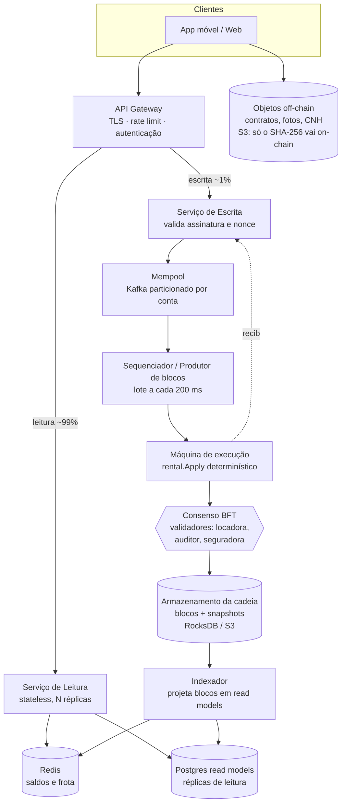

# Aluguel de Carros com Blockchain

**Tokenização de depósitos e caução em uma blockchain escrita em Go**

Proposta de sistema empregando blockchain para aluguel de carros, utilizando tokenização não fungível de bens para custodia e pagamentos. 
Realizado como avaliação no curso de Sistemas de Informação na Universidade do Estado do Amazonas.

---

## 1. Introdução

Blockchain funcional escrita do zero em **Go 1.23**, usando apenas a biblioteca padrão (zero
dependências externas), com um **ledger de aluguel de carros** rodando em cima dela e uma
**interface web em português** onde a mesma pessoa pode se colocar no papel de administrador,
proprietário ou locatário e ainda inspecionar a cadeia bloco por bloco.

```bash
cd car-rent-blockchain
go test ./...                  # testes da cadeia, das regras de locação e da API
go run ./cmd/console           # fase 1: a demo portada do Java
go run ./cmd/server --debug    # fases 2 e 3: http://localhost:8080
```

A flag `--debug` libera a demonstração de adulteração de blocos no explorador — o recurso didático
mais importante do projeto, explicado na seção 6.

### Mapa do código

```text
car-rent-blockchain/
  blockchain/      bloco, hash SHA-256, prova de trabalho, validação da cadeia
  rental/          contratos, transações, estado do mundo, replay, mensagens pt-BR
  api/             servidor HTTP: a cadeia e o ledger expostos como JSON
  web/             app de navegador
  cmd/server/      binário do servidor
```

---

## 2. O problema

Alugar um carro envolve **dinheiro parado em mãos de terceiros**: o locatário entrega uma caução
que fica sob controle exclusivo da locadora até que alguém, dentro dela, decida devolvê-la. Isso
gera dores concretas:

- **Opacidade da custódia** — o locatário não pode verificar que a caução existe, quanto é, ou se
  já foi liberada; a única fonte de verdade é o banco de dados interno da locadora.
- **Assimetria na liquidação** — quem decide o valor do dano é a mesma parte que recebe o dinheiro,
  sem trilha auditável do cálculo.
- **Disputas sem prova** — logs de sistema pertencem a uma das partes e podem ser editados.
- **Conciliação manual** — locadora, proprietário da frota e locatário mantêm planilhas diferentes
  do mesmo aluguel.
- **Dinheiro bloqueado sem regra explícita** — o prazo de liberação da caução é só uma promessa
  operacional, não verificável.

O denominador comum: **o estado do negócio vive em um banco que uma das partes pode alterar sem
deixar rastro, e as regras de liquidação vivem no código interno dessa mesma parte.** Isso exige
**histórico imutável e verificável**, **regras executadas de forma determinística**, **custódia que
não pertence a nenhuma das partes** e **autorização explícita por papel**.

---

## 3. Blockchain: o fundamental

Uma blockchain é uma lista encadeada onde **cada elo é um hash criptográfico do elo anterior**.
Isso basta para que alterar qualquer registro antigo quebre, de forma detectável, todos os
registros posteriores.

```go
// blockchain/block.go
type Block struct {
	Index        int
	Timestamp    int64
	Hash         string
	PreviousHash string
	Data         string // a carga: no nosso caso, uma transação JSON
	Nonce        int
}

func CalculateHash(b *Block) string {
	sum := sha256.Sum256([]byte(b.hashInput()))
	return hex.EncodeToString(sum[:])
}

// ProofOfWork exige que o hash comece com N zeros: como SHA-256 é
// imprevisível, o único caminho é tentar valores de Nonce até acertar.
func (b *Block) ProofOfWork(difficulty int) {
	b.Nonce = 0
	target := Zeros(difficulty) // "000" para dificuldade 3
	for !strings.HasPrefix(b.Hash, target) {
		b.Nonce++
		b.Hash = CalculateHash(b)
	}
}
```

Cada zero adicional multiplica por ~16 o trabalho esperado, o que torna reescrever a história caro:
quem adultera um bloco precisa reminerar esse bloco e todos os seguintes.

Validar a cadeia é refazer três perguntas em cada bloco: o índice segue o anterior? o
`PreviousHash` aponta para o hash do bloco anterior? o hash armazenado é igual ao recalculado?

```go
// blockchain/blockchain.go
func isValidNewBlock(newBlock, previousBlock *Block) bool {
	return previousBlock.Index+1 == newBlock.Index &&
		newBlock.PreviousHash == previousBlock.Hash &&
		CalculateHash(newBlock) == newBlock.Hash // <- pega qualquer alteração em Data
}
```

**É só isso.** Blocos, hash encadeado, prova de trabalho e validação — quatro ideias. Todo o resto
do sistema é domínio de negócio construído sobre essa base.

---

## 4. Como resolvemos o problema com blockchain

O pacote [rental/](car-rent-blockchain/rental/) transforma a cadeia genérica da seção 3 em um
**ledger de locação**, e cada dor da seção 2 vira uma propriedade do protocolo:

- **Cada bloco carrega uma transação** — `Block.Data` é um JSON `{from, to, method, args, nonce}`,
  endereçado a um contrato (ex.: `{"from":"bob","to":"rental","method":"StartRental",...}`).
- **O estado é derivado, nunca armazenado** — não existe banco de dados do estado; saldos, carros e
  locações são o resultado de `Replay`, que reaplica todas as transações em ordem. Não há `UPDATE`:
  mudar um saldo exige um bloco, e mudar um bloco antigo exige reminerar a cadeia inteira.
- **Contratos decidem as regras** — dois contratos, `token` (saldos e emissão) e `rental` (carros e
  locações), cada um dono de uma fatia do estado. `rental` nunca move saldo diretamente: chama
  métodos internos do `token` (ex.: `transfer`) que não são expostos a transações externas — a
  mesma ideia de um escrow chamando um ERC-20, só que via chamada de método Go.
- **Autorização por papel, no protocolo** — cada contrato declara o papel exigido por método
  (`RoleAdmin`, `RoleOwner`, `RoleRenter`); o despacho verifica conta, nonce sequencial, método e
  papel **antes** de qualquer efeito, o que também resolve replay e duplicação por retry de rede.
- **Atomicidade** — toda transação roda sobre uma cópia do estado; se qualquer regra falhar, a
  cópia é descartada e nenhum bloco é minerado.
- **Validação completa** — `ValidateChain` verifica a integridade criptográfica (hash, prova de
  trabalho, encadeamento) e reexecuta todas as regras de negócio, apontando **qual** bloco falhou e
  **por quê**, em português.

| Dor (seção 2) | Como a blockchain resolve |
| --- | --- |
| Custódia opaca | A caução vai para a conta `escrow`, visível em `GET /api/accounts`, e sai dela apenas por `SettleRental` |
| Liquidação assimétrica | O cálculo é aritmética determinística em `settleRental`, auditável por qualquer parte |
| Disputa sem prova | Cada ação é um bloco minerado, com timestamp e hash encadeado |
| Conciliação manual | Há um único ledger; todas as partes derivam o mesmo estado do mesmo histórico |
| Regra implícita | Os contratos `token` e `rental` *são* o contrato jurídico, em código executável |

---

## 5. Tokenização

**Tokenizar é representar um direito econômico como saldo transferível em um ledger, sujeito a
regras executáveis.** Aqui o ativo tokenizado é o **depósito de caução**.

- **Token de depósito** — saldos em `uint64` (nunca float, para não acumular erro), emissão
  controlada só por `MintDeposit`/`ADMIN`, e aritmética verificada contra overflow em todo crédito e
  multiplicação.
- **Invariante contábil** — `TotalHeld() == Minted`: nenhuma operação cria ou destrói valor, apenas
  movimenta. Alugar, devolver e liquidar são transferências; só `MintDeposit` altera o total.
  Testado em [rental/rental_test.go](car-rent-blockchain/rental/rental_test.go).
- **Escrow sem papel** — a pseudoconta `escrow` não tem `Role`, então não pode assinar transações
  nem receber emissão direta. Ela só se move como efeito colateral das regras de locação: em vez de
  "confie que não mexemos na caução", é **estruturalmente impossível mexer**.
- **Carro tokenizado** — um registro com dono, diária, depósito mínimo e status
  (`AVAILABLE`/`RENTED`); o status no ledger é o que impede locação dupla.

Ciclo de vida do token:

```text
MintDeposit     admin ──emite 1000──▶ bob
StartRental     bob ──600 tokens──▶ escrow     [carro: RENTED]
ReturnCar       (nenhum token se move)         [locação: RETURNED]
SettleRental    escrow ──cobrança──▶ alice
                escrow ──reembolso──▶ bob      [carro: AVAILABLE, locação: CLOSED]
```

Na liquidação: a cobrança é limitada pela caução (o excesso fica registrado como `Unpaid`, dívida
transparente fora da cadeia), o escrow nunca retém resíduo (`charge + refund == deposit`, sempre), e
o preço é imutável — travado no `StartRental`, independente de mudanças futuras na diária.

---

## 6. Exemplos

### Demo do terminal (fase 1)

```bash
cd car-rent-blockchain && go run ./cmd/console
```

Porta a demo original em Java: minera uma cadeia com dificuldade 4 e confirma
`"A blockchain é válida? Sim, é válida!"`.

### Aluguel completo via HTTP

Servidor: `go run ./cmd/server --debug`. Contas de desenvolvimento: `admin` (ADMIN), `alice`
(OWNER), `bob` (RENTER).

```bash
curl -s localhost:8080/api/tx -d '{"from":"admin","to":"token","method":"MintDeposit","nonce":1,"args":{"to":"bob","amount":1000}}'
curl -s localhost:8080/api/tx -d '{"from":"alice","to":"rental","method":"RegisterCar","nonce":1,"args":{"dailyRate":100,"minDeposit":300}}'
curl -s localhost:8080/api/tx -d '{"from":"bob","to":"rental","method":"StartRental","nonce":1,"args":{"carId":1,"days":5,"deposit":600}}'
curl -s localhost:8080/api/tx -d '{"from":"bob","to":"rental","method":"ReturnCar","nonce":2,"args":{"rentalId":1}}'
curl -s localhost:8080/api/tx -d '{"from":"admin","to":"rental","method":"SettleRental","nonce":2,"args":{"rentalId":1,"damageCharge":50}}'
# -> {"carId":1,"rentalId":1,"paid":550,"refunded":50,"unpaid":0}
```

`GET /api/accounts` confirma a contabilidade: `550 + 50 == 600` (depósito) e
`400 + 550 + 50 == 1000` (minted). Transações inválidas (caução baixa, papel errado, método no
contrato errado, nonce repetido) são rejeitadas com `422` e não geram bloco.

### Demonstração de adulteração

Com `--debug`, o explorador permite editar o `Data` de um bloco já minerado — o que um banco de
dados tradicional permitiria a um administrador com acesso de escrita:

```bash
curl -s -X POST localhost:8080/api/debug/tamper/3 -d '{"data":"..."}'
curl -s localhost:8080/api/validate
# -> {"valida": false, "blocoInvalido": 3, "motivo": "...dados do bloco foram alterados."}
```

A cadeia aponta o bloco exato e o motivo, e enquanto inválida o servidor recusa qualquer transação
nova. `POST /api/debug/restore/3` desfaz a adulteração.

### Interface web

```bash
go run ./cmd/server --debug   # http://localhost:8080
```

Tudo em pt-BR; um seletor no topo troca o papel ativo:

| Papel | Conta | Abas |
| --- | --- | --- |
| Administrador | `admin` | Frota · Administração · Explorador da Blockchain |
| Proprietário | `alice` | Frota · Meus carros · Explorador da Blockchain |
| Locatário | `bob` | Frota · Alugar · Explorador da Blockchain |

O Explorador mostra a lista de blocos e o estado derivado da cadeia, deixando visível que saldos e
locações são consequência do histórico, não dados armazenados.

### Testes

```bash
cd car-rent-blockchain && go test ./...
```

Três suítes (`api`, `blockchain`, `rental`) cobrem hash e detecção de cadeia corrompida, cada regra
de negócio e o invariante `TotalHeld() == Minted`, e o comportamento HTTP da API.

---

## 7. System design para produção (1 milhão de usuários ou mais)

### 7.1 Onde o protótipo não escala

Honestidade primeiro. O que roda hoje é um nó único, didático:

| Limitação atual | Por que não serve em produção |
| --- | --- |
| **Um bloco por transação** | 1M de usuários geram milhões de blocos; o custo por transação é o de um bloco inteiro |
| **Prova de trabalho no caminho da requisição** | O `POST /api/tx` só responde depois de minerar; latência imprevisível por construção |
| **`ValidateChain` + `Replay` a cada escrita** | O(n) sobre a cadeia inteira a cada transação — quadrático no histórico |
| **Cadeia em memória** | Reiniciar o processo zera tudo |
| **`sync.RWMutex` global** | Serializa toda a escrita em um processo; não há caminho para escala horizontal |
| **Sem assinatura criptográfica** | `tx.From` é uma string sem prova de autoria; qualquer um pode se dizer `admin` |
| **Três contas fixas** | `DefaultAccounts` é um array no código |
| **Nó único** | Sem réplica, sem consenso: a imutabilidade depende de confiar no operador |

O último item é o mais sério conceitualmente: **uma blockchain com um único nó operado por uma das
partes resolve a auditabilidade, mas não a confiança.** O operador pode reminerar a cadeia inteira
offline e apresentar uma história alternativa consistente.

### 7.2 Dimensionando a carga

Antes de desenhar, estimar. Com 1M de usuários registrados:

- **Usuários ativos por dia:** ~3% → 30.000
- **Transações de escrita por dia:** ~5 por aluguel (emitir, registrar, alugar, devolver, liquidar),
  com ~10.000 aluguéis/dia → **~50.000 escritas/dia ≈ 0,6 tx/s em média, ~30 tx/s no pico**
- **Leituras:** consultar frota, saldo, locações, explorador → **~200× as escritas, ~5.000 req/s no
  pico**

A conclusão que orienta todo o desenho: **a carga de escrita é pequena e a de leitura é enorme.**
Um ledger ordenado consegue 30 tx/s sem dificuldade; o desafio real é servir leitura em escala e
manter latência de escrita previsível.

### 7.3 Arquitetura proposta



### 7.4 As sete decisões que fazem a diferença

**1. Trocar prova de trabalho por consenso BFT entre validadores conhecidos.**
PoW existe para resolver identidade aberta e anônima. Aqui as partes são conhecidas — locadora,
auditor independente, seguradora, associação de proprietários — e cada uma roda um validador.
Protocolos como IBFT ou Tendermint dão **finalidade determinística em menos de 1 s**, sem queimar
energia, e mantêm a propriedade essencial: nenhuma parte isolada reescreve a história, porque
alterar um bloco exige maioria qualificada dos validadores.

**2. Lotes de transações por bloco, não uma por bloco.**
O sequenciador fecha um bloco a cada ~200 ms com todas as transações pendentes. No pico de 30 tx/s,
são ~6 transações por bloco e ~430 mil blocos/ano — em vez de dezenas de milhões. A latência do
usuário passa a ser o intervalo do lote, constante e previsível, não o tempo de minerar.

**3. Snapshots de estado, para que `Replay` deixe de ser O(n).**
O estado completo é persistido a cada N blocos (merkleizado, para que o snapshot seja verificável
contra o bloco). Partir de um snapshot custa O(blocos desde o snapshot). A cadeia inteira continua
disponível para auditoria completa — mas isso vira um trabalho em lote, não o caminho crítico de
cada requisição.

**4. CQRS: separar o ledger de escrita dos modelos de leitura.**
O ledger é a fonte da verdade e otimiza integridade. O indexador consome os blocos e projeta
*read models* desnormalizados em Postgres (com réplicas de leitura) e saldos/frota em Redis. Os
~5.000 req/s de leitura nunca tocam a execução; o Redis absorve a maior parte. As leituras ficam
*eventualmente consistentes*, com defasagem sub-segundo — aceitável para saldo e frota, e o cliente
pode confirmar a finalidade de uma escrita pelo recibo.

**5. Assinatura Ed25519 por transação, com custódia de chaves por KMS/HSM.**
`tx.From` passa a ser uma chave pública, e a transação carrega assinatura sobre
`(from, method, args, nonce, chainId)`. Isso fecha a lacuna mais grave do protótipo: a autoria
torna-se criptograficamente provável, e o nonce — que já existe — passa a proteger contra replay de
verdade. Chaves de usuário ficam no dispositivo (carteira) ou em custódia via KMS; chaves de
validador em HSM. O `chainId` na mensagem impede replay entre ambientes.

**6. Particionamento por conta, preservando o determinismo.**
O mempool Kafka é particionado pelo `from`, o que mantém a ordem dos nonces de cada conta sem
coordenação global. A execução é single-writer por shard de estado (contas e carros particionados
por hash); locações que cruzam shards usam commit em duas fases dentro do mesmo bloco. É o caminho
de escala horizontal que o `sync.RWMutex` global não oferece.

**7. Dados pesados off-chain, apenas o hash on-chain.**
Contrato assinado, fotos de vistoria, CNH e laudo de dano vão para S3 com criptografia; o bloco
guarda só o SHA-256 e a URI. Isso mantém os blocos pequenos, e ainda assim qualquer parte prova que
o documento apresentado hoje é idêntico ao registrado no aluguel. É também o que torna o sistema
compatível com o direito ao esquecimento da LGPD: o objeto pode ser destruído sem quebrar a cadeia —
só o hash, que não é dado pessoal, permanece.

### 7.5 Operação

- **Observabilidade:** latência por método de transação, profundidade do mempool, defasagem do
  indexador, taxa de erro por código (`ErrDepositTooLow`, `ErrBadNonce`...). A taxa de rejeição por
  código é também um sinal de produto, não só de infraestrutura.
- **Idempotência ponta a ponta:** o nonce por conta já faz do retry uma operação segura; o cliente
  reenvia a mesma transação assinada sem risco de cobrar duas vezes.
- **Invariantes como alarme:** um job contínuo verifica `TotalHeld() == Minted` e
  `escrow == Σ depósitos de locações ativas`. Divergência é incidente de severidade máxima — é a
  evidência de bug de contabilidade, e detectá-la em minutos é o que separa um erro de um prejuízo.
- **Evolução de regras:** mudar a lógica de liquidação muda o resultado do replay do histórico. As
  regras precisam ser versionadas por altura de bloco, com o nó aplicando a versão vigente à época
  de cada bloco. Isso é o equivalente, aqui, a uma migração de banco de dados — e é
  significativamente mais restritivo.
- **Recuperação:** o estado é sempre reconstruível a partir da cadeia, então o backup crítico é a
  cadeia (replicada entre os validadores, por construção) mais os snapshots. Os read models são
  descartáveis: reconstruir é reindexar.

### 7.6 O que não muda

Vale notar o que sobrevive intacto do protótipo para a produção: **o pacote `rental` inteiro.**
`State`, `Apply`, os dois contratos, a aritmética verificada, o escrow sem papel, o invariante contábil —
nada disso depende de consenso, persistência ou escala. É a lógica de negócio determinística, e o
trabalho das seções acima é só construir, ao redor dela, uma infraestrutura capaz de ordenar
transações de forma confiável e servir leitura em volume.

Essa separação é, no fim, a lição de arquitetura do projeto: **a blockchain é o mecanismo de
ordenação e integridade; o valor está nas regras que você executa deterministicamente sobre ela.**
